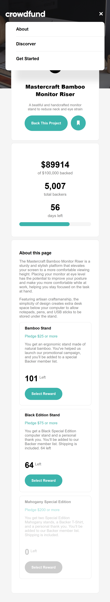

# crowdfunding-product-page-main

**crowdfunding product page main and award giving**

## About the project

The Mastercraft Bamboo Monitor Riser is a sturdy and stylish platform that elevates your screen
to a more comfortable viewing height. Placing your monitor at eye level has the potential to improve
your posture and make you more comfortable while at work, helping you stay focused on the task at hand.

Featuring artisan craftsmanship, the simplicity of design creates extra desk space below your computer
to allow notepads, pens, and USB sticks to be stored under the stand.

**LINKS**

## To visit the project ( visit )

https://crowdfunding-product-page-main-zeta.vercel.app/

---

## To visit the project repository ( visit )

https://github.com/Nelson19so/crowdfunding-product-page-main.git

---

<h1>Tools and tech used</h1>

- HTML & CSS
- Javascript

coded from scratch

<h3>Desktop version</h3>

Desktop view mode

Desktop modal view mode

Desktop success modal view

<!-- mobile view -->

Also responsible for mobile mode

<h3>Mobile version</h3>

Mobile view mode

mobile modal view

mobile view with navbar

mobile success modal view

Mastercraft Bamboo Monitor Riser
A beautiful & handcrafted monitor stand to reduce neck and eye strain.

## Buitl with

- Semantic HTML5 markup
- CSS custom properties
- Flexbox
- CSS Grid
- Mobile-first workflow
- Javascript
